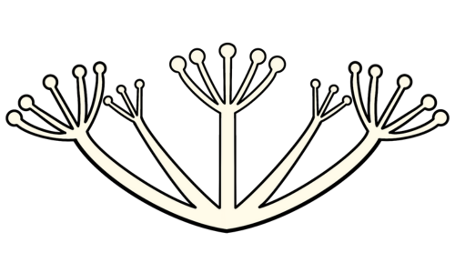

  <h1 align="center">
  
    CARAWAY
  </h1>

## What is Caraway?
Caraway is an educational Web Application designed to teach you all about the native plants in your state!  Enter the garden of dreams and then choose the state you'd like to learn about from the drop down.  Each time you select a state, a wide variety of plants will be displayed for you to interact with and enjoy.  Learn more about how you can protect bees and your natural wildlife from the navigation bar, and plan your native garden today!

## Demo Video

## Usage
Caraway is hosted with github pages. Use this [link](https://michaellgans.github.io/garden_of_dreams/) to navigate to our page. Once on the homepage, you can enter into the garden with the 'Start Exploring' button. The garden page allows you to select your state and get started!

## Inspiration
This project was part of our HackSprint in the third trimester at Atlas School Tulsa. Our prompt was based around building a 'Garden of Dreams', but we were allowed flexibility in our design and purpose. 

## Authors
[Allison Binger](https://www.linkedin.com/in/allisonbinger/) - [GitHub](https://www.github.com/allisonabinger)
[Michael Gans]((https://www.linkedin.com/in/michaellgans/)) - [GitHub](https://www.github.com/michaellgans)
